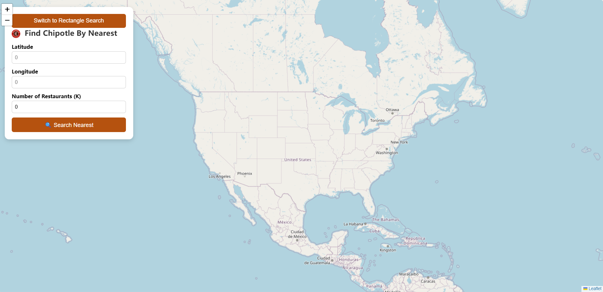
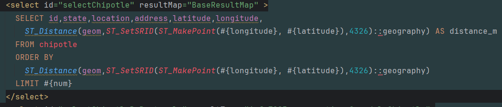
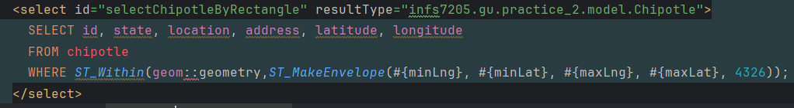
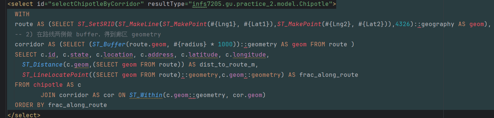
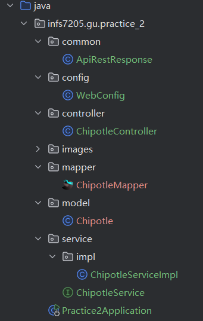
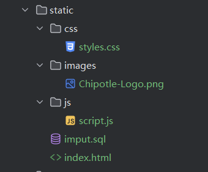

Chipotle Store Locator

This is an interactive web application that can help users explore the locations of Chipotle restaurants across the United States in three ways using spatial queries supported by PostgreSQL/PostGIS, and visualize them through leaf.

Main interface

✨Features
.Interactive Map: Leaflet.js for pan/zoom and custom markers

.Nearest-K Search: Find the K closest Chipotle stores to a given point

.Rectangle Query: List all stores within a user-defined bounding box

.Corridor Search: List all stores within a buffered “corridor” along a line segment

.Custom Markers & Layers: Highlight query geometry (point, rectangle, corridor) on the map

.Robust Input Handling: Alerts on invalid or missing parameters

🛠️ Technologies
Backend: Java 21, Spring Boot 3.0.3, MyBatis, PostgreSQL with PostGIS extension

Frontend: HTML/CSS/JS, Leaflet.js

Build: Maven

Dev Tools: IntelliJ IDEA 2024, pgAdmin

🚀 Installation Guide
1. Database Setup
   CREATE DATABASE Practice_2;
   \c Practice_2
   CREATE EXTENSION postgis;
   CREATE TABLE chipotle (
   id        SERIAL PRIMARY KEY,
   state     TEXT      NOT NULL,
   location  TEXT      NOT NULL,
   address   TEXT      NOT NULL,
   latitude  DOUBLE PRECISION NOT NULL,
   longitude DOUBLE PRECISION NOT NULL,
   geom      GEOGRAPHY(Point,4326)
   );
    UPDATE chipotle
   SET geom = ST_SetSRID(ST_MakePoint(longitude,latitude),4326)::geography
   WHERE geom IS NULL;
    CREATE INDEX idx_chipotle_geom ON chipotle USING GIST(geom);
    in command:
   \copy chipotle(state,location,address,latitude,longitude)
   FROM '/path/to/chipotle_stores.csv'
   WITH (FORMAT csv, HEADER true);

2. Backend (Spring Boot)
   Configure src/main/resources/application.properties:
   spring.datasource.url=jdbc:postgresql://localhost:5432/chipotle_db
   spring.datasource.username=your_user
   spring.datasource.password=your_password
   spring.datasource.driver-class-name=org.postgresql.Driver
   mybatis.mapper-locations=classpath*:mapper/*.xml
   mybatis.type-aliases-package=infs7205.gu.practice_2.model
   Run: 
   mvn clean spring-boot:run
   Backend listens on http://localhost:8080.

3. Frontend
   Access via browser:
   http://localhost:63342/Practice_2/static/index.html

explanation of three query:

Each query uses the geom GIST index for spatial filtering and ordering:
1.  Nearest-K Search

Index Use: The ORDER BY ST_Distance(...) on a geography type leverages the GIST index for KNN .
Purpose: Return the k closest stores by actual spherical distance.

2.  Rectangle Bounding-Box

Casting: geom::geometry to match ST_MakeEnvelope (geometry) signature.
Index Use: GIST index on geom supports fast bounding-box tests.
Purpose: List all stores inside a user-defined rectangle.

3.   Corridor Search

Line & Buffer: Create a geography line then buffer by radius .
Index Use: Buffer geometry join also hits GIST index for spatial containment.
Purpose: Find stores within a corridor along a path and order them by position along the route

💻 Usage
Open the application in your browser at http://localhost:63342/Practice_2/static/index.html

Nearest Mode:
Enter lat, lng, k → Search Nearest → map plots location + k nearest store markers.

Rectangle Mode:
Enter minLat, minLng, maxLat, maxLng → Search Rectangle → map plots rectangle & enclosed stores.

Corridor Mode:
Enter lat1, lng1, lat2, lng2, radius → Search Corridor → map plots line, buffer corridor, and stores along it.

🔌 API Endpoints
| Endpoint                   | Method | Params                                   | Description                                 |
| -------------------------- | ------ | ---------------------------------------- | ------------------------------------------- |
| `/storeInquiry`            | POST   | `latitude`, `longitude`, `num`           | Nearest-K search                            |
| `/storeInquiryByRectangle` | POST   | `minLat`, `minLng`, `maxLat`, `maxLng`   | Rectangle bounding-box search               |
| `/storeInquiryByCorridor`  | POST   | `Lat1`, `Lng1`, `Lat2`, `Lng2`, `radius` | Corridor search                             |
| `/corridorGeo`             | GET    | `Lat1`, `Lng1`, `Lat2`, `Lng2`, `radius` | Returns corridor polygon as GeoJSON for map |

Each endpoint example returns:
{
"status": 200,
"message": "success",
"data": [ array of Chipotle JSON objects or GeoJSON  ]
}

📁 Backend Project Structure

📁 Frontend Project Structure

